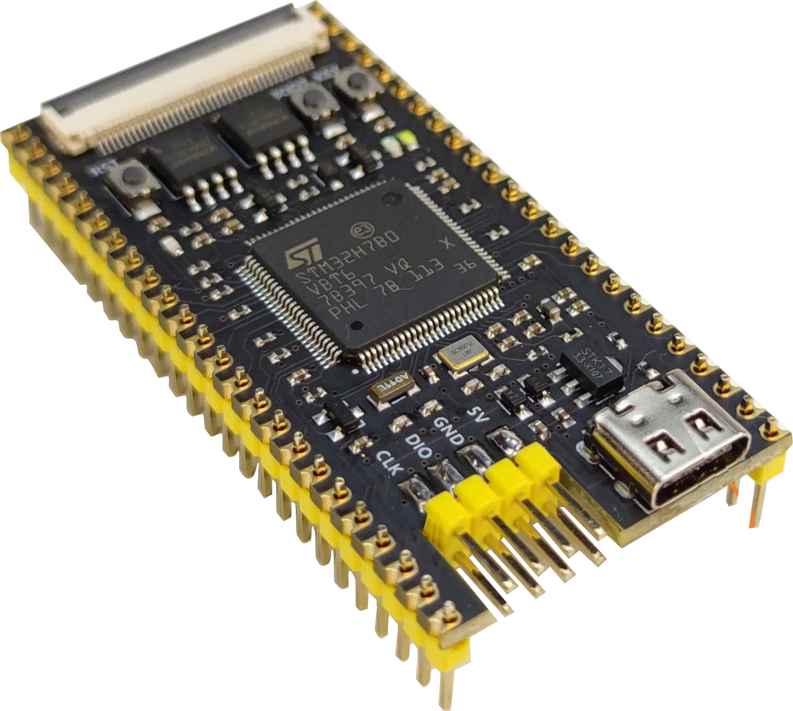
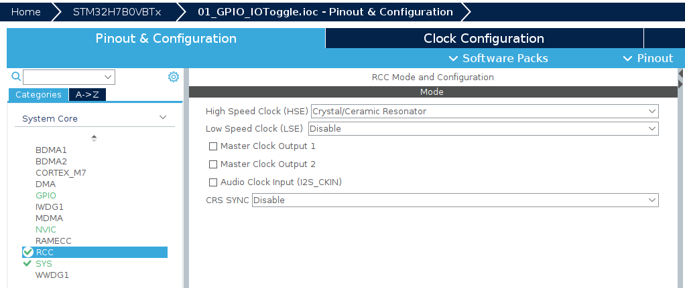
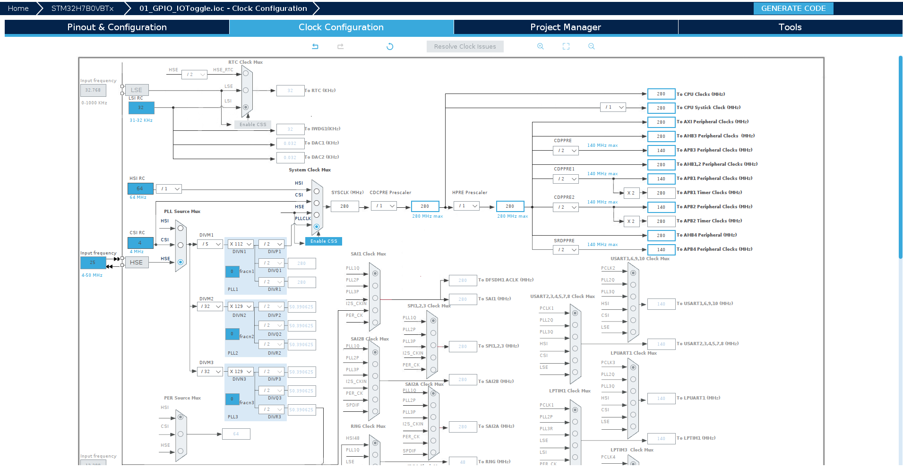
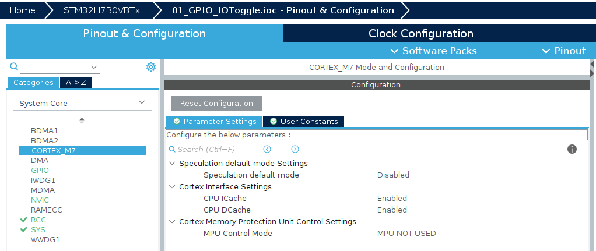

# STM32H7B0 with STM32CubeIDE

## FK7B0M1-VBT6 Core Board Overview

The **FK7B0M1-VBT6** core board by FANKE Technology Co., Ltd. is an advanced microcontroller platform based on the STMicroelectronics Arm® Cortex®-M7 core STM32H7B0VBT6 microcontroller. This board is an ideal solution for developers looking to create high-performance applications, especially in the field of Human-Machine Interface (HMI), leveraging its robust capabilities and support for sophisticated display and touch technologies.



### Key Features

- **Microcontroller**: STM32H7B0VBT6 in an LQFP100 package, offering powerful processing capabilities.
- **Clock speed**: Operates at up to 280MHz, ensuring quick response and processing times for demanding applications.
- **Crystal oscillators on board**:
  - Main clock: External 25MHz crystal oscillator.
  - RTC: 32.768kHz crystal oscillator.
- **Memory**:
  - 128 Kbytes of flash memory and 1 Kbyte of OTP (One-Time Programmable) memory.
  - Approximately 1.4 Mbytes of RAM, including:
    - 192 Kbytes of TCM RAM (64 Kbytes ITCM RAM + 128 Kbytes DTCM RAM) for time-critical routines.
    - 1.18 Mbytes of user SRAM.
    - 4 Kbytes of SRAM in Backup domain.
- **External Flash memory**:
  - 64-Mbit QSPI (W25Q64) NOR Flash memory.
  - 64-Mbit SPI (W25Q64) NOR Flash memory.
- **Interfaces**:
  - 1 RGB LCD interface for high-quality display connectivity.
    - Supports LCD displays up to 800 x 480 pixels, ideal for rich user interface development, and can be used without external SDRAM memory.
    - Capacitive touch screen panel support, enhancing interactive applications.
  - Buttons: 1 reset button, 1 user button, and 1 BOOT button for user interaction.
  - Indicators: 1 user LED for status indication.
  - Connectivity: 1 USB type C interface and 1 micro SD card interface for expanded functionalities.
- **Additional Features**:
  - SWD and serial port accessibility through a pin header.
  - 39 IO ports brought out for versatile connection options.
  
### Application Development and Utility

The FK7B0M1-VBT6 is designed as a reference design for user application development before transitioning to the final product, significantly simplifying the development process. Its wide range of hardware features, including advanced display and touch capabilities, make it exceptionally suitable for HMI applications, allowing for comprehensive evaluation and testing of peripherals and functionalities.

---

Overall, the FK7B0M1-VBT6 core board by FANKE Technology is a versatile and powerful platform, suitable for developers looking to harness the capabilities of the STM32H7B0VBT6 microcontroller for advanced applications, particularly in the realm of HMI development.


## General Instruction for New Projects

1. Flash the boot binary on internal FLASH memory.
2. Create the project on STM32CubeMX.
3. On **System Core > RCC**, configure the **High Speed Clock (HSE)** to **Crystal/Ceramic Resonator**.

    

4. Set the clock configurations as shown in the image below.

    

5. Navigate to **System Core > CORTEX-M7** and:
    1. Disable the **Speculation default mode**.
    2. Enable the **ICache** and **DCache**.

    

6. On STM32CubeMX, click on **GENERATE CODE**.
7. Delete the **STM32H7B0VBTX_RAM.ld** file.
8. Apply the **0001-enable-external-flash-qspi.patch** to set up the linker script to external FLASH memory and relocate the VTABLE.

    ```console
    git apply 0001-enable-external-flash-qspi.patch
    ```

## Sample Code

- [01_GPIO_IOToggle](/01_GPIO_IOToggle/)
